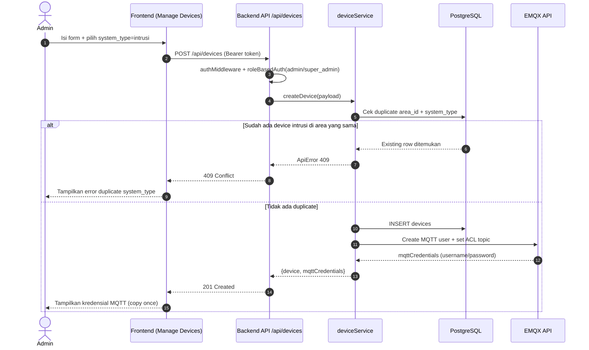
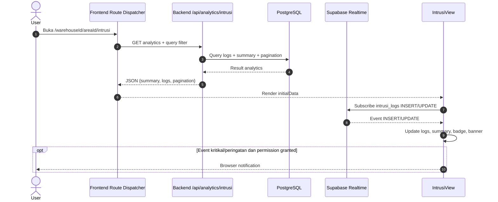
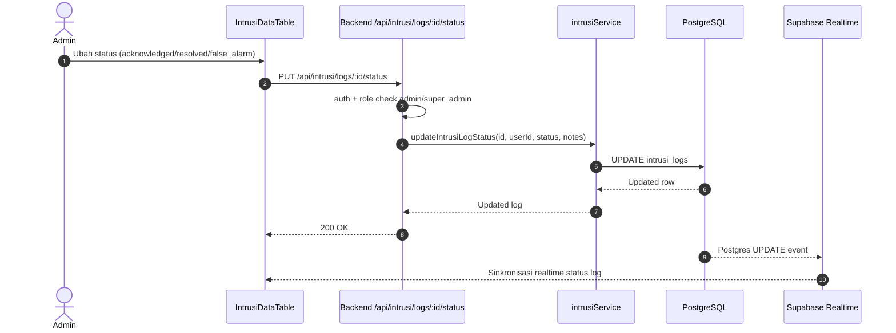
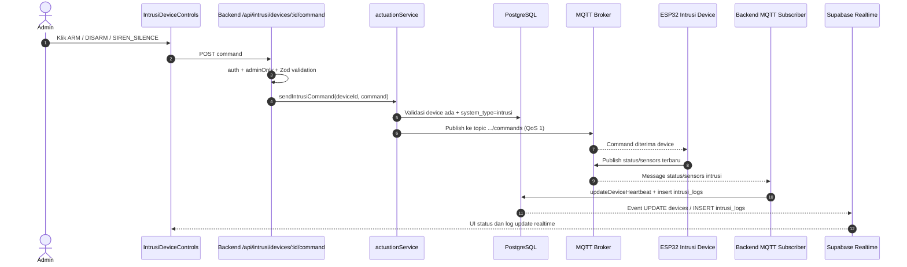
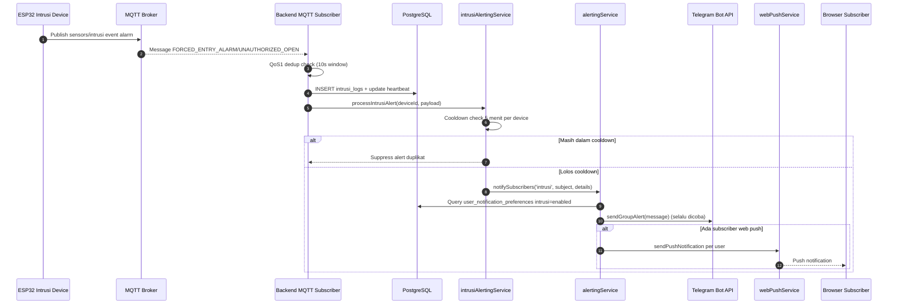
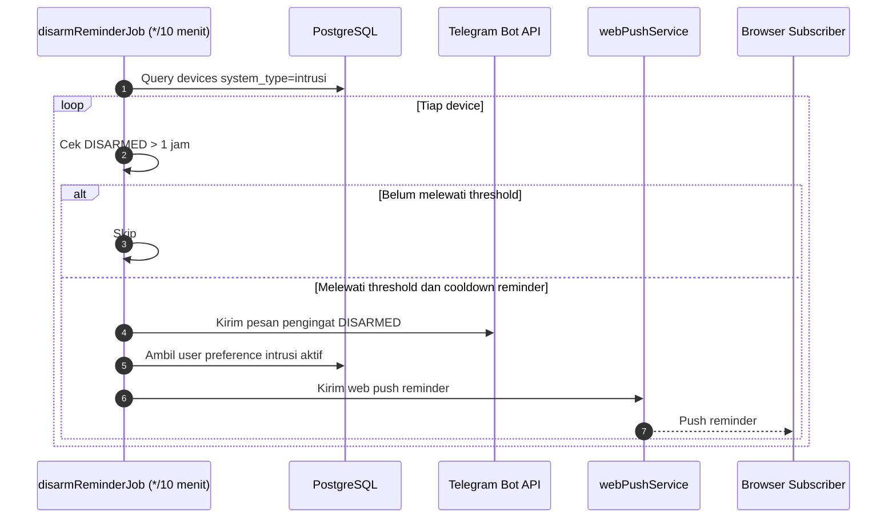

# Spesifikasi Sistem Intrusi End-to-End (Frontend + Backend)

Dokumen ini disusun dari pembacaan implementasi aktual pada codebase frontend dan backend, fokus khusus pada domain intrusi (keamanan pintu gudang).

## 1. Tujuan dan Ruang Lingkup

Tujuan dokumen:
- Menjadi referensi teknis lengkap untuk alur intrusi dari penambahan device sampai notifikasi Telegram.
- Menjelaskan apa yang terjadi di frontend, backend, database, MQTT, dan notifikasi secara end-to-end.

Ruang lingkup dokumen:
- Alur penambahan device intrusi.
- Pengaturan dan operasi halaman intrusi di frontend.
- Alur backend intrusi (API, service, MQTT ingestion, status engine, cron).
- Bentuk-bentuk notifikasi Telegram yang terkait intrusi secara lengkap.

Di luar ruang lingkup:
- Detail domain keamanan kamera dan lingkungan, kecuali titik integrasi yang berpengaruh ke intrusi.

## 2. Peta File Inti yang Dianalisis

### 2.1 Frontend
- app/(main)/management/devices/page.tsx
- components/actions/DeviceActions.tsx
- lib/api/devices.ts
- app/(main)/[warehouseId]/[areaId]/[systemType]/page.tsx
- features/intrusi/api/intrusi.ts
- features/intrusi/components/IntrusiView.tsx
- features/intrusi/components/IntrusiDeviceControls.tsx
- features/intrusi/components/IntrusiDataTable.tsx
- features/intrusi/components/IntrusiEventChart.tsx
- lib/api/types.ts
- components/app-navigation.tsx
- hooks/use-nav-areas.ts
- lib/api/navigation.ts
- components/profile/UpdatePreferencesForm.tsx
- app/(main)/profile/page.tsx
- components/telegram/TelegramManager.tsx
- app/(main)/management/users/page.tsx
- middleware.ts
- lib/supabase/middleware.ts
- lib/api/client.ts

### 2.2 Backend
- src/server.ts
- src/api/middlewares/authMiddleware.ts
- src/api/routes/deviceRoutes.ts
- src/api/controllers/deviceController.ts
- src/services/deviceService.ts
- src/services/emqxService.ts
- src/features/intrusi/routes/intrusiRoutes.ts
- src/features/intrusi/controllers/intrusiController.ts
- src/features/intrusi/services/intrusiService.ts
- src/features/intrusi/services/actuationService.ts
- src/features/intrusi/services/intrusiAlertingService.ts
- src/features/intrusi/analytics/intrusiAnalytics.ts
- src/features/intrusi/jobs/disarmReminderJob.ts
- src/mqtt/client.ts
- src/services/alertingService.ts
- src/services/telegramService.ts
- src/api/routes/telegramRoutes.ts
- src/api/controllers/telegramAdminController.ts
- src/api/controllers/telegramWebhookController.ts
- src/services/navigationService.ts
- src/db/schema.ts
- src/jobs/heartbeatChecker.ts

## 3. Ringkasan Arsitektur Intrusi

Alur besar intrusi:
1. Device intrusi ditambahkan via halaman Manajemen Perangkat (frontend).
2. Backend membuat record device dan provisioning MQTT credential + ACL di EMQX.
3. Device publish status/sensor ke topic MQTT khusus device.
4. Backend subscribe topic, parse payload, deduplicate, update heartbeat, simpan intrusi_logs.
5. Untuk event alarm, backend jalankan alerting pipeline (Telegram + web push).
6. Frontend intrusi menampilkan data dari API analytics, lalu realtime dari Supabase postgres_changes.
7. Admin dapat kirim command ARM/DISARM/SIREN_SILENCE ke device via backend -> MQTT publish.

## 4. Model Data Intrusi

### 4.1 Tabel devices (field yang relevan intrusi)
- id (UUID)
- area_id
- name
- system_type
- status (Online/Offline)
- last_heartbeat
- door_state (OPEN/CLOSED)
- intrusi_system_state (ARMED/DISARMED)
- siren_state (ON/COOLDOWN/OFF)
- power_source (MAINS/BATTERY)
- vbat_voltage
- vbat_pct

### 4.2 Tabel intrusi_logs (field utama)
- id
- device_id
- timestamp
- event_type
- system_state
- door_state
- peak_delta_g
- hit_count
- payload (JSON)
- status (unacknowledged/acknowledged/resolved/false_alarm)
- acknowledged_by
- acknowledged_at
- notes
- notification_sent_at

### 4.3 Event type yang dipakai UI/API intrusi
- IMPACT_WARNING
- FORCED_ENTRY_ALARM
- UNAUTHORIZED_OPEN
- POWER_SOURCE_CHANGED
- BATTERY_LEVEL_CHANGED
- SIREN_SILENCED
- ARM
- DISARM

Catatan implementasi:
- Tipe event di beberapa bagian backend schema juga menampilkan varian ARMED/DISARM sebagai type union lama/berbeda.
- Runtime ingestion menggunakan payload data.type dari MQTT.

## 5. Alur Penambahan Device Intrusi

## 5.1 Prasyarat akses

Frontend:
- Route management dibatasi oleh middleware frontend:
  - /management/* hanya admin/super_admin
  - /management/users hanya super_admin

Backend:
- /api/devices dipasang di server dengan authMiddleware.
- POST /api/devices membutuhkan role admin/super_admin (roleBasedAuth).

## 5.2 Alur UI frontend (Manajemen Perangkat)

Komponen utama:
- app/(main)/management/devices/page.tsx
- components/actions/DeviceActions.tsx

Langkah:
1. User buka halaman manajemen perangkat.
2. Klik Tambah Perangkat.
3. Form menampilkan field:
   - name (min 3 karakter)
   - system_type: keamanan | intrusi | lingkungan
   - warehouse_id
   - area_id
4. Saat pilih warehouse, frontend fetch area berdasarkan warehouse.
5. Submit form -> panggil createDevice(data, token).

Payload create device:
{
  "name": "Door Intrusion Area A",
  "area_id": "<uuid-area>",
  "system_type": "intrusi"
}

## 5.3 Validasi dan proses backend create device

Endpoint:
- POST /api/devices

Validasi route (Zod):
- name wajib
- area_id wajib UUID valid
- system_type harus salah satu: keamanan/intrusi/lingkungan

Logika service (transaction):
1. Cek duplikasi kombinasi area_id + system_type.
2. Jika sudah ada, return 409 (tidak boleh ada system_type sama dalam area yang sama).
3. Insert device baru.
4. Karena system_type intrusi bukan keamanan:
   - Load relasi area + warehouse.
   - Provision device ke EMQX.
5. Return:
   - device
   - mqttCredentials

Response create device (intrusi):
{
  "device": { ... },
  "mqttCredentials": {
    "username": "device-<device_id>",
    "password": "pwd-<device_id>-<timestamp>"
  }
}

## 5.4 Provisioning EMQX untuk device intrusi

Service:
- src/services/emqxService.ts

Langkah:
1. Buat user MQTT:
   - username: device-<device_id>
   - password: generated unik
2. Buat ACL rules:
   - Publish allow: warehouses/<wid>/areas/<aid>/devices/<did>/#
   - Subscribe allow: warehouses/<wid>/areas/<aid>/devices/<did>/commands

## 5.5 UX pasca-create di frontend

Perilaku AddDeviceButton:
- Jika mqttCredentials ada (intrusi/lingkungan), frontend tampilkan dialog kredensial dan meminta user copy.
- Jika mqttCredentials null (keamanan), dialog langsung ditutup dan list direfresh.

Catatan penting:
- Password MQTT hanya ditampilkan sekali di UI create flow.

## 5.6 Dampak setelah device intrusi dibuat

- Device intrusi baru ikut muncul pada:
  - halaman manajemen perangkat
  - endpoint navigasi per system_type (areas-by-system)
  - sidebar intrusi (setelah fetch nav areas)
- URL monitoring intrusi menjadi tersedia: /<warehouseId>/<areaId>/intrusi

## 6. Pengaturan dan Operasi Halaman Intrusi di Frontend

## 6.1 Routing dan data awal

Dispatcher route:
- app/(main)/[warehouseId]/[areaId]/[systemType]/page.tsx

Untuk systemType=intrusi:
1. Frontend fetch analytics backend:
   - GET /api/analytics/intrusi?area_id=...&page=...&per_page=...&from=...&to=...&status=...&event_type=...&system_state=...&door_state=...
2. Render IntrusiView dengan initialData.

Data awal yang dipakai IntrusiView:
- logs
- summary
- pagination

## 6.2 Navigasi intrusi di sidebar

Sumber data:
- hooks/use-nav-areas.ts
- GET /api/navigation/areas-by-system?system_type=intrusi

Sifat data:
- Hanya area yang punya device intrusi (join areas + devices + filter devices.system_type='intrusi').
- Sidebar juga difilter oleh selected warehouse.

## 6.3 Komponen IntrusiView (fitur utama)

File:
- features/intrusi/components/IntrusiView.tsx

Fungsi utama:
- Menampilkan page title, date range picker, ringkasan event.
- Menampilkan alert banner jika ada unacknowledged event kritikal/peringatan.
- Menyisipkan IntrusiDeviceControls.
- Menyisipkan IntrusiDataTable.

Ringkasan yang ditampilkan:
- total_events
- alarm_events
- impact_warnings
- unacknowledged
- acknowledgement rate

Realtime behavior:
- Subscribe intrusi_logs INSERT dan UPDATE via Supabase Realtime.
- INSERT:
  - prepend log ke state
  - update summary counters
  - update device status context online
  - trigger browser notification untuk event kritikal/peringatan
- UPDATE:
  - patch log lokal
  - sinkronkan hitung unacknowledged jika status berubah

Browser notification:
- Request permission saat mount (jika default).
- Trigger hanya untuk:
  - FORCED_ENTRY_ALARM
  - UNAUTHORIZED_OPEN
  - IMPACT_WARNING
- Dedupe berdasarkan log id (set notifiedRef).

## 6.4 Komponen IntrusiDeviceControls (pengaturan perangkat)

File:
- features/intrusi/components/IntrusiDeviceControls.tsx

Data fetch awal:
1. GET /api/devices/details?area_id=<areaId>&system_type=intrusi
2. GET /api/intrusi/devices/<deviceId>/status

Realtime subscribe:
- Tabel devices UPDATE (filter id device) untuk:
  - Online/Offline
  - door_state
  - intrusi_system_state
  - siren_state
  - power_source
  - vbat_voltage
  - vbat_pct
- Tabel intrusi_logs event *:
  - update state status lokal
  - jika status acknowledgement log berubah, komponen refetch status backend untuk akurasi AMAN/WASPADA/BAHAYA

Role gating kontrol:
- Hanya admin/super_admin (isAdmin) yang bisa kirim command.
- User non-admin hanya lihat status (tanpa tombol kontrol).

Command dari UI:
- ARM (disabled bila sudah ARMED)
- DISARM (disabled bila sudah DISARMED)
- SIREN_SILENCE (enabled bila siren ON atau COOLDOWN)

Endpoint command:
- POST /api/intrusi/devices/<deviceId>/command

Payload command:
- { "cmd": "ARM" }
- { "cmd": "DISARM" }
- { "cmd": "SIREN_SILENCE", "issued_by": "dashboard" }
- { "cmd": "STATUS" }

## 6.5 Komponen IntrusiDataTable (pengaturan data log)

File:
- features/intrusi/components/IntrusiDataTable.tsx

Kemampuan tabel:
- Badge status (unacknowledged/acknowledged/resolved/false_alarm).
- Badge event type.
- Kolom state sistem, state pintu, peak delta g, anomaly/hit count, timestamp, notes.
- Expandable row form untuk update status + notes.
- Bulk acknowledge untuk multiple log unacknowledged.
- Filter multi-select via URL query:
  - status
  - event_type
  - system_state
  - door_state
- Export CSV.
- Pagination server-driven via page/per_page query params.
- Keyboard shortcuts:
  - j/k atau arrow untuk fokus baris
  - Enter buka/tutup detail
  - a pilih baris
  - Esc clear selection

Update status log dari tabel:
- PUT /api/intrusi/logs/<logId>/status
- Payload: { status, notes? }

Role gating tabel:
- Non-admin: kolom aksi, select, expander disembunyikan.

## 6.6 Pengaturan preferensi notifikasi user (frontend)

File:
- components/profile/UpdatePreferencesForm.tsx

Sistem yang bisa toggle:
- keamanan
- intrusi
- lingkungan

Endpoint:
- GET /api/users/me/preferences
- PUT /api/users/me/preferences

Catatan penting implementasi:
- Toggle preferensi mempengaruhi pemilihan user penerima web push.
- Telegram group alert intrusi tetap dikirim walaupun subscriber prefs kosong.

## 6.7 Pengaturan Telegram admin di frontend

File:
- components/telegram/TelegramManager.tsx
- app/(main)/management/users/page.tsx

Fitur:
- Generate single-use invite link Telegram.
- List members aktif/nonaktif.
- Kick member.
- Send test alert ke grup.

Role:
- Halaman management/users hanya untuk super_admin.

## 7. Alur Backend Intrusi Detail

## 7.1 Mount route dan auth

Server mounts:
- /api/intrusi dipasang dengan authMiddleware global pada path tersebut.

Auth middleware:
- Verifikasi Bearer JWT.
- Mendukung verifikasi RS256/ES256 via JWKS atau HS256 via SUPABASE_JWT_SECRET.
- req.user berisi id, email, role.

Role-based intrusi routes:
- GET logs/summary/status: user terautentikasi (tanpa adminOnly).
- POST command: adminOnly (admin/super_admin).
- PUT log status: adminOnly.

## 7.2 API contract intrusi backend

### Endpoint baca
- GET /api/intrusi/devices/:deviceId/logs
  - query: limit, offset, from, to, event_type
- GET /api/intrusi/devices/:deviceId/summary
  - query: from, to
- GET /api/intrusi/devices/:deviceId/status

### Endpoint tulis
- POST /api/intrusi/devices/:deviceId/command
  - body discrimated union cmd: ARM | DISARM | SIREN_SILENCE | STATUS
- PUT /api/intrusi/logs/:id/status
  - body: status, notes?

## 7.3 Analytics intrusi

Jalur:
- GET /api/analytics/intrusi
- analyticsService memilih intrusiAnalyticsConfig

Filter didukung:
- status (multi value CSV)
- event_type (multi value CSV)
- system_state (multi value CSV)
- door_state (multi value CSV)
- from/to
- area_id
- page/per_page

Response shape:
{
  "summary": { ... },
  "logs": [ ... ],
  "pagination": {
    "total": <int>,
    "page": <int>,
    "per_page": <int>,
    "total_pages": <int>
  }
}

## 7.4 MQTT ingestion intrusi (runtime paling kritis)

File:
- src/mqtt/client.ts

Subscribe topic:
- warehouses/+/areas/+/devices/+/sensors/#
- warehouses/+/areas/+/devices/+/status

Proteksi data:
- Retained message di-skip (hindari false Online).
- QoS1 dedup window 10 detik, key: deviceId + systemType + payloadHash.

### 7.4.1 Status topic (.../status)

Saat pesan status masuk:
1. Parse JSON jika valid.
2. Ambil field intrusi dari status:
   - door -> door_state
   - state -> intrusi_system_state
   - siren -> siren_state
   - power -> power_source
   - vbat_v -> vbat_voltage
   - vbat_pct -> vbat_pct
3. Panggil processPowerAlert bila ada power/vbat info.
4. updateDeviceHeartbeat(deviceId, extraFields).

Efek updateDeviceHeartbeat:
- status device = Online
- last_heartbeat = now
- field-field intrusi diperbarui jika ada nilai

### 7.4.2 Sensor topic (.../sensors/intrusi)

Saat pesan sensor intrusi masuk:
1. Parse JSON payload.
2. Dedup check.
3. Derive siren_state berdasarkan event:
   - SIREN_SILENCED -> COOLDOWN
   - FORCED_ENTRY_ALARM atau UNAUTHORIZED_OPEN -> ON
   - DISARM -> OFF
4. updateDeviceHeartbeat untuk door/system/siren.
5. ingestIntrusiEvent insert row intrusi_logs.
6. Jika event alarm (FORCED_ENTRY_ALARM/UNAUTHORIZED_OPEN), panggil processIntrusiAlert.

## 7.5 Status engine AMAN/WASPADA/BAHAYA

Service:
- getIntrusiStatus(device_id)

Logika:
1. Ambil latestEvent.
2. Ambil latestAlarm (FORCED_ENTRY_ALARM/UNAUTHORIZED_OPEN).
3. Default status AMAN.
4. Jika latestAlarm unacknowledged:
   - cari clearing event setelah alarm: DISARM atau SIREN_SILENCED
   - jika clearing event ada atau currentSystemState DISARMED -> AMAN
   - selain itu -> BAHAYA
5. Jika masih AMAN, currentSystemState ARMED, dan ada IMPACT_WARNING unacknowledged -> WASPADA

Output:
- status
- system_state
- door_state
- latest_event
- latest_alarm

## 7.6 Update status log intrusi

Service:
- updateIntrusiLogStatus(logId, userId, status, notes)

Perilaku:
- Validasi log ada.
- Update status + notes.
- acknowledged_by diisi userId.
- acknowledged_at diisi now.

Catatan:
- acknowledged_by/acknowledged_at diisi setiap update status, termasuk saat status diset ke nilai selain acknowledged.

## 7.7 Actuation command ke device intrusi

Service:
- sendIntrusiCommand(deviceId, command)

Validasi:
- Device harus ada.
- system_type harus intrusi.

Publish MQTT:
- Topic: warehouses/<wid>/areas/<aid>/devices/<did>/commands
- Payload: JSON command
- QoS: 1

## 7.8 Offline detection job

File:
- src/jobs/heartbeatChecker.ts

Logika:
- Tiap 1 menit, tandai Offline untuk device Online dengan last_heartbeat lebih lama dari 2 menit.

## 8. Notifikasi Telegram Intrusi (Lengkap)

## 8.1 Prasyarat konfigurasi

Env backend relevan:
- TELEGRAM_BOT_TOKEN
- TELEGRAM_GROUP_ID
- TELEGRAM_WEBHOOK_URL
- TELEGRAM_WEBHOOK_SECRET

Jika token/group tidak ada:
- telegramService.sendGroupAlert return false dan log warning.

## 8.2 Jalur dispatch notifikasi

Komponen utama:
- intrusiAlertingService.ts (menentukan kapan trigger)
- alertingService.ts (formatter dan fanout Telegram + web push)
- telegramService.ts (hit Telegram Bot API)

Skema umum notifySubscribers(systemType='intrusi', subject, emailProps):
1. Query user_notification_preferences where system_type='intrusi' and is_enabled=true.
2. Telegram task selalu dijalankan ke grup (tidak bergantung jumlah subscriber).
3. Push task hanya jika userIds > 0.

Konsekuensi penting:
- Preference user tidak mematikan pengiriman Telegram group.
- Preference user hanya mengontrol siapa yang dapat web push.

## 8.3 Template Telegram dari alertingService (jalur utama)

Template umum:
<emoji-status> <b><status-text></b> <emoji-status>

Location: <warehouse> - <area>
Device: <device>
Type: <incidentType> (opsional)
Detail:
- key: value
- ...

Time: <timestamp WIB>

Harap segera diperiksa.

Penentuan status-text:
- Jika subject mengandung kata PERINGATAN atau karakter alarm icon -> status-text = PERINGATAN BAHAYA
- Selain itu -> status-text = KEMBALI NORMAL

Catatan implementasi:
- Subject tertentu seperti BATERAI KRITIS tidak selalu mengandung kata PERINGATAN atau alarm icon, sehingga status-text dapat menjadi KEMBALI NORMAL walau konteksnya kritis.

## 8.4 Trigger intrusi dan bentuk notifikasinya

### Trigger A: Alarm intrusi (FORCED_ENTRY_ALARM / UNAUTHORIZED_OPEN)

Sumber:
- mqtt client saat sensor intrusi event alarm -> processIntrusiAlert

Cooldown:
- 5 menit per device (suppress duplicate incident)

Subject:
- [alarm icon] [ALARM INTRUSI] <incidentType> di <warehouse> - <area>

incidentType:
- UNAUTHORIZED_OPEN -> Pembukaan Pintu Tidak Sah
- FORCED_ENTRY_ALARM -> Percobaan Pembobolan (Forced Entry)

Detail fields di message:
- Tipe Event: data.type
- Status Pintu: data.door
- Mode Sistem: AKTIF/NON-AKTIF berdasarkan data.state
- Untuk forced entry: Peak Impact (g)
- Untuk forced entry: Jumlah Anomali (Window) atau Hit Count

### Trigger B: Pergantian sumber daya (MAINS <-> BATTERY)

Sumber:
- processPowerAlert dari status topic jika power source berubah

Subject:
- Switch ke baterai:
  - [power icon] [DAYA BERALIH] <device> beralih ke Baterai - <warehouse>
- Pulih ke adaptor:
  - [recovery icon] [DAYA PULIH] <device> kembali ke Adaptor - <warehouse>

Detail fields:
- Sumber Daya: BATTERY atau ADAPTOR (PLN)
- Kapasitas Baterai (jika ada)
- Tegangan (jika ada)

### Trigger C: Baterai kritis

Sumber:
- processPowerAlert jika:
  - vbat_pct <= 10
  - power_source == BATTERY
  - lewat cooldown 30 menit dari alert kritis terakhir

Subject:
- [battery icon] [BATERAI KRITIS] <device> di <warehouse> - <area>

Detail fields:
- Kapasitas Baterai: <pct>%
- Tegangan: <volt>V (jika ada)
- Sumber Daya: BATERAI (Adaptor Terputus)

Cooldown:
- 30 menit per device untuk alert baterai kritis

### Trigger D: Disarm reminder periodik

Sumber:
- disarmReminderJob (cron tiap 10 menit)

Kondisi kirim:
- Device intrusi dalam status DISARMED (atau null) lebih dari 1 jam.
- Reminder diulang setiap 1 jam selama masih DISARMED.

Pesan Telegram (template khusus, bukan dari alertingService):
- Header: PENGINGAT: SISTEM BELUM DIAKTIFKAN
- Lokasi, Device
- Status: NON-AKTIF selama lebih dari 1 jam
- Waktu cek (WIB)
- Ajakan segera aktifkan sistem

Tambahan:
- Job ini juga kirim web push ke user dengan preference intrusi aktif.

### Trigger E: Manual test alert oleh super_admin

Endpoint:
- POST /api/telegram/test-alert

Template pesan:
- Header: TEST ALERT
- Kalimat bahwa ini pesan tes monitoring
- Dikirim oleh: email requester
- Waktu (WIB)
- Kalimat konfirmasi integrasi

## 8.5 Telegram admin dan lifecycle member

### Endpoint admin Telegram (super_admin)
- POST /api/telegram/invite
- POST /api/telegram/kick
- GET /api/telegram/members
- GET /api/telegram/webhook-info
- POST /api/telegram/setup-webhook
- POST /api/telegram/test-alert

### Webhook publik Telegram
- POST /api/telegram/webhook (tanpa auth app, pakai secret header Telegram)

Webhook behavior:
- new_chat_members -> insert/update telegram_subscribers status active
- left_chat_member -> update status left
- pesan biasa dari member yang belum tercatat -> auto-register member

## 9. Security, Role, dan Hak Akses Intrusi

Frontend:
- /management/* hanya admin/super_admin.
- /management/users hanya super_admin.

Backend:
- Semua route intrusi butuh authMiddleware.
- GET logs/summary/status: semua user terautentikasi.
- POST command + PUT log status: admin/super_admin.

UI behavior:
- Non-admin tetap bisa melihat data intrusi.
- Tombol kontrol device dan aksi review log dibatasi untuk admin.

## 10. Sequence End-to-End yang Direkomendasikan (Operasional)

## 10.1 Provisioning device intrusi baru
1. Admin buka /management/devices.
2. Tambah device intrusi dan submit.
3. Backend validasi + insert + provisioning EMQX.
4. Admin simpan MQTT credential dari dialog.
5. Device firmware dikonfigurasi dengan credential/topic yang sesuai.
6. Device mulai publish status/sensor.
7. Sidebar intrusi area tersedia dan halaman intrusi bisa dipantau.

## 10.2 Runtime monitoring dan kontrol
1. User buka /<warehouse>/<area>/intrusi.
2. Frontend fetch analytics intrusi area.
3. Realtime intrusi_logs/devices aktif.
4. Event alarm masuk -> log baru -> badge/banner update.
5. Backend kirim Telegram + web push (sesuai aturan).
6. Admin review log (ack/resolved/false_alarm).
7. Jika perlu admin kirim ARM/DISARM/SIREN_SILENCE.

## 11. Catatan Implementasi Penting (Hasil Analisis Mendalam)

1. Telegram intrusi selalu mencoba kirim ke group, walau tidak ada subscriber preference intrusi.
2. Subscriber preference intrusi saat ini efektif untuk web push recipients, bukan hard gate Telegram.
3. Cooldown intrusi alarm 5 menit mencegah duplicate alarm pada event beruntun (contoh UNAUTHORIZED_OPEN lalu FORCED_ENTRY_ALARM).
4. Battery critical dan power-change diolah dari status topic, bukan hanya dari intrusi_logs.
5. Status AMAN/WASPADA/BAHAYA ditentukan server-side, lalu dipakai frontend controls.
6. Frontend controls juga melakukan optimistik update status lokal dari stream log, dan refetch status saat status log berubah agar konsisten.
7. SIREN_SILENCE dapat dipakai ketika siren ON atau COOLDOWN di UI.
8. Satu area tidak boleh memiliki dua device dengan system_type yang sama.
9. system_type device tidak bisa diubah setelah create.
10. Delete device non-keamanan mencoba deprovision EMQX; jika deprovision gagal, proses delete device tetap dilanjutkan.

## 12. Checklist Verifikasi Cepat untuk Tim

### 12.1 Saat menambah intrusi device
- Role user admin/super_admin.
- area_id benar.
- Belum ada intrusi device lain pada area sama.
- MQTT credentials berhasil muncul dan disalin.

### 12.2 Saat halaman intrusi tidak menampilkan data
- Cek route area/systemType benar.
- Cek device intrusi ada via /api/devices/details.
- Cek analytics intrusi dengan area_id mengembalikan logs.
- Cek Supabase Realtime subscription aktif.

### 12.3 Saat Telegram tidak masuk
- Cek TELEGRAM_BOT_TOKEN dan TELEGRAM_GROUP_ID.
- Cek webhook secret dan endpoint webhook.
- Cek log suppress cooldown (mungkin sedang cooldown).
- Cek trigger event alarm benar-benar terjadi di payload MQTT.

### 12.4 Saat device sering Offline
- Cek publish heartbeat/status dari device.
- Cek MQTT broker connectivity.
- Ingat cutoff Offline backend adalah >2 menit tanpa heartbeat.

---

Dokumen ini menggambarkan implementasi aktual pada codebase saat ini dan bisa dipakai sebagai baseline teknis untuk pengembangan, debugging, audit, dan onboarding developer/AI agent khusus domain intrusi.

## 13. Diagram Sequence Skenario Utama

Bagian ini menerapkan visualisasi alur end-to-end untuk skenario inti sistem intrusi.

### 13.1 Sequence: Provisioning Device Intrusi Baru

## 14. Spesifikasi Pengujian Latency End-to-End

Sistem intrusi kini mendukung pengujian latency end-to-end yang benar-benar berasal dari firmware device (device-origin), bukan hanya simulasi publish dari backend/harness.

Komponen inti yang aktif untuk mode ini:

1. Firmware command test deterministik di topic commands:
  - TEST_FORCED_ENTRY
  - TEST_UNAUTHORIZED_OPEN
  - TEST_BATTERY_CRITICAL
  - TEST_POWER_TO_BATTERY
  - TEST_POWER_TO_MAINS
2. Metadata trace lintas stage:
  - trace_id
  - test_run_id
  - test_scenario
  - seq
  - test_bypass_cooldown
  - device_ms
  - publish_ms
3. Tracking timestamp backend terintegrasi:
  - t1_mqtt_rx_ms
  - t2_db_insert_ms
  - t3_alert_decision_ms
  - t4_notify_dispatch_ms
  - t5_telegram_api_ack_ms

Dokumentasi teknis detail spesifikasi + metodologi uji tersedia pada:

- DOKUMENTASI_PENGUJIAN_LATENCY_INTRUSI_E2E.md

Dokumen tersebut memuat:

1. Metode pengujian step-by-step untuk baseline, SLA run, dan burst test.
2. Definisi metrik p50/p95/p99 per stage dan E2E.
3. Format artefak laporan (CSV/JSON/Markdown) yang siap dipakai sebagai bukti penelitian/laporan.
4. Panduan mitigasi risiko saat eksekusi di lingkungan production.

### 13.2 Sequence: Buka Halaman Intrusi dan Realtime Monitoring

### 13.3 Sequence: Review/Acknowledge Log Intrusi

### 13.4 Sequence: Kirim Command ARM/DISARM/SIREN ke Device

### 13.5 Sequence: Alarm Intrusi Sampai Telegram dan Web Push

### 13.6 Sequence: Disarm Reminder Periodik

